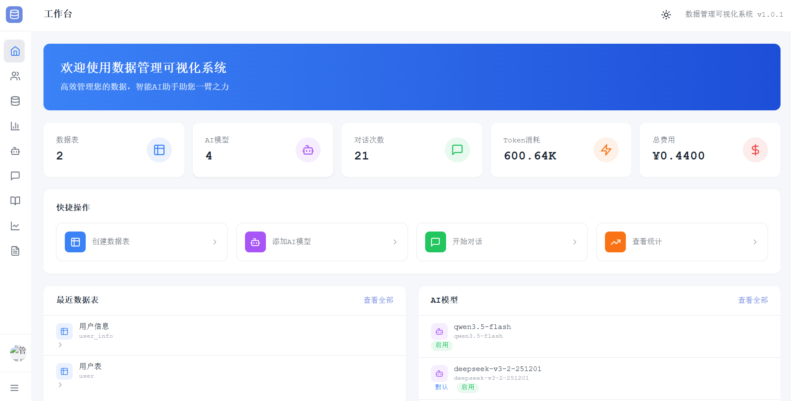
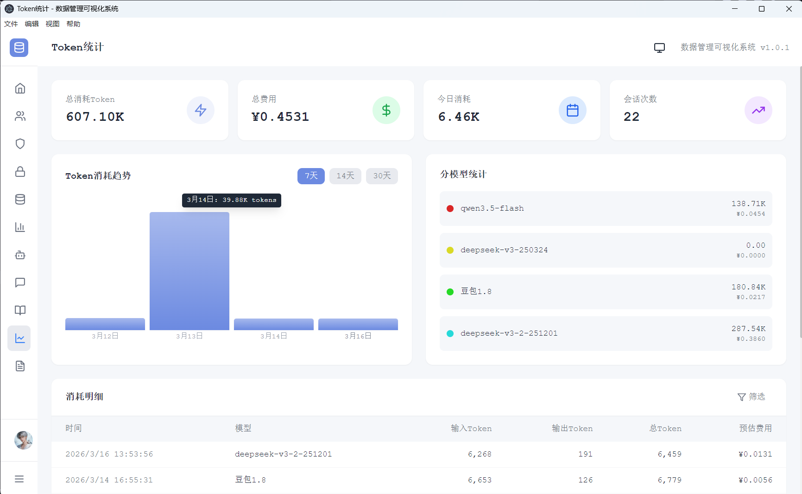

# 数据管理可视化系统

一个支持动态建表、数据管理、可视化展示、AI智能对话的数据管理系统。

> **本项目由 [CodeBuddy CN](https://www.codebuddy.cn/home/) AI编程助手全程辅助开发。** CodeBuddy CN 是一款强大的AI编程工具，支持代码生成、智能重构、Bug修复等功能，大幅提升开发效率。

## 系统预览

**系统首页** - 展示数据概览、快捷操作入口、系统状态等核心信息



**Token统计页面** - 展示AI模型Token消耗记录、费用统计、按模型/日期筛选分析



## 技术栈

| 层级 | 技术 | 说明 |
|------|------|------|
| 前端框架 | Vue 3 + TypeScript + Vite | 响应式框架，组件化开发 |
| UI组件库 | TDesign Vue Next | 腾讯企业级组件库 |
| 样式方案 | TailwindCSS + Less | 原子化CSS + 预处理器 |
| 图表可视化 | ECharts | 丰富的图表类型 |
| 图标库 | Lucide Vue Next | 现代化图标库 |
| 桌面客户端 | Electron 28 | 跨平台桌面应用 |
| 后端框架 | NestJS (Node.js) | TypeScript全栈统一 |
| 数据库 | MySQL + TypeORM | 支持JSON字段，动态建表 |
| 缓存 | Redis + ioredis | 数据缓存，验证码存储 |
| AI集成 | LangChain.js | 多模型统一适配（OpenAI、通义千问、智谱、豆包等） |
| 认证 | JWT + Passport | 用户认证与授权 |
| 邮件 | Nodemailer | 邮箱验证码登录 |

## 运行模式

本系统支持两种运行模式：

| 模式 | 说明 | 适用场景 |
|------|------|---------|
| **Web模式** | 浏览器访问，前后端分离部署 | 团队协作、云端部署 |
| **桌面模式** | Electron桌面客户端 | 个人使用、本地数据管理 |

## 项目结构

```
data-management-system/
├── frontend/                    # 前端项目 (Vue 3 + Vite)
│   ├── src/
│   │   ├── api/                # API接口封装
│   │   │   ├── ai-model.ts     # AI模型管理接口
│   │   │   ├── auth.ts         # 认证相关接口
│   │   │   ├── dynamic-data.ts # 动态数据接口
│   │   │   ├── knowledge-base.ts # 知识库接口
│   │   │   ├── table-meta.ts   # 表元数据接口
│   │   │   ├── token-usage.ts  # Token消耗接口
│   │   │   ├── user.ts         # 用户管理接口
│   │   │   └── view-config.ts  # 视图配置接口
│   │   ├── components/         # 公共组件
│   │   ├── layouts/            # 布局组件
│   │   ├── views/              # 页面视图
│   │   │   ├── ai-chat/        # AI对话页面
│   │   │   ├── ai-model/       # AI模型管理页面
│   │   │   ├── audit-log/      # 审计日志页面
│   │   │   ├── dashboard/      # 仪表盘页面
│   │   │   ├── data-manage/    # 数据管理页面
│   │   │   ├── knowledge-base/ # 知识库管理页面
│   │   │   ├── login/          # 登录页面
│   │   │   ├── permission-manage/ # 权限管理页面
│   │   │   ├── role-manage/    # 角色管理页面
│   │   │   ├── settings/       # 系统设置页面
│   │   │   ├── table-manage/   # 表管理页面
│   │   │   ├── token-stats/    # Token统计页面
│   │   │   ├── user-manage/    # 用户管理页面
│   │   │   └── visualization/  # 可视化页面
│   │   ├── stores/             # Pinia状态管理
│   │   ├── router/             # 路由配置
│   │   ├── types/              # 类型定义
│   │   └── utils/              # 工具函数
│   └── package.json
├── backend/                     # 后端项目 (NestJS)
│   ├── src/
│   │   ├── modules/            # 业务模块
│   │   │   ├── ai-model/       # AI模型管理（模型配置、对话、工具调用）
│   │   │   ├── audit-log/      # 审计日志模块
│   │   │   ├── auth/           # 认证模块（登录、验证码、密码修改）
│   │   │   ├── dynamic-data/   # 动态数据模块
│   │   │   ├── knowledge-base/ # 知识库模块
│   │   │   ├── mail/           # 邮件服务模块
│   │   │   ├── permission/     # 权限管理模块
│   │   │   ├── redis-cache/    # Redis缓存模块
│   │   │   ├── role/           # 角色管理模块
│   │   │   ├── table-meta/     # 表元数据模块
│   │   │   ├── token-usage/    # Token消耗统计模块
│   │   │   ├── upload/         # 文件上传模块
│   │   │   ├── user/           # 用户管理模块
│   │   │   └── view-config/    # 视图配置模块
│   │   ├── resource/           # 静态资源目录（头像、文件等）
│   │   ├── common/             # 公共模块（过滤器、拦截器、装饰器）
│   │   ├── database/           # 数据库配置与实体
│   │   └── main.ts             # 入口文件
│   └── package.json
├── desktop/                     # Electron桌面客户端
│   ├── main.js                 # 主进程入口
│   ├── preload.js              # 预加载脚本
│   ├── .npmrc                  # npm镜像配置
│   └── package.json
├── dump.rdb                     # Redis数据快照
├── package.json                 # 根项目配置
└── README.md
```

## 快速开始

### 环境要求

| 软件 | 版本要求 | 说明 |
|------|---------|------|
| Node.js | >= 18.0.0 | 推荐 20.x LTS |
| MySQL | >= 8.0 | 数据库 |
| Redis | >= 6.0 | 缓存服务 |
| npm | >= 9.0 | 包管理器 |

### 安装依赖

```bash
# 一键安装所有依赖
cd data-management-system
npm run install:all

# 或分别安装
cd data-management-system/backend && npm install
cd ../frontend && npm install
cd ../desktop && npm install
```

### 后端启动

```bash
cd data-management-system/backend
cp .env.example .env
# 编辑 .env 配置数据库连接信息
npm run start:dev
```

### 前端启动（Web模式）

```bash
cd data-management-system
npm run dev
# 或
cd frontend && npm run dev
```

### Electron桌面客户端启动

**国内用户**：首次安装需要配置 Electron 镜像，在 `desktop` 目录创建 `.npmrc` 文件：

```
electron_mirror=https://npmmirror.com/mirrors/electron/
```

**启动开发模式**：

```bash
# 终端1：启动后端服务
cd data-management-system/backend
npm run start:dev

# 终端2：启动Electron客户端
cd data-management-system
npm run dev:electron
```

**打包桌面应用**：

```bash
# 打包 Windows 版本
cd data-management-system
npm run build:electron

# 或进入 desktop 目录单独打包
cd desktop
npm run build:win    # Windows
npm run build:mac    # macOS
npm run build:linux  # Linux
```

### 初始化管理员账号

```bash
cd data-management-system/backend
npm run db:init-admin
```

## 功能模块

### 用户认证
- 用户名+密码登录
- 邮箱+密码登录
- 邮箱+验证码登录
- JWT Token认证
- 密码修改

### 数据表管理
- 可视化定义表结构
- 支持多种字段类型（文本、数字、日期、枚举、JSON、富文本等）
- 建表后自动生成CRUD管理页面
- 支持表字段排序、必填、默认值设置

### 数据管理
- 表格视图：支持排序、筛选、分页
- 卡片视图：卡片式数据展示
- 图表视图：柱状图、折线图、饼图
- 分组统计：按字段分组聚合查询
- 数据导入导出

### AI模型管理
- 支持多种AI模型类型：
  - OpenAI (GPT-3.5/GPT-4)
  - 通义千问 (Qwen)
  - 智谱AI (GLM)
  - 豆包模型 (Doubao)
  - 自定义模型
- 模型启用/禁用切换
- 设置默认模型
- 模型连接测试
- 模型定价配置

### AI智能对话
- 自然语言查询数据
- 流式响应（SSE）
- 深度思考模式（Thinking）
- 工具调用能力：
  - 列出数据表
  - 查看表结构
  - 查询表数据
  - 统计数据
  - 聚合分析
  - 分组统计
  - 搜索知识库
  - 插入记录
  - 更新记录
- 知识库增强模式
- 多轮对话上下文

### 知识库管理
- 知识条目CRUD
- 支持分类管理
- AI对话智能检索

### Token消耗统计
- 消耗记录查询
- 按模型/日期统计
- 费用估算（基于模型定价）

### 用户管理
- 用户CRUD
- 用户状态切换（启用/禁用）
- 密码重置
- 最后登录时间记录
- 用户头像上传

### 角色管理
- 角色CRUD
- 角色权限配置
- 用户角色分配

### 权限管理
- 权限CRUD
- 权限分类管理
- 基于RBAC的权限控制

### 审计日志
- 操作日志记录
- 日志查询与筛选

### 文件上传
- 头像上传
- 通用文件上传
- 文件大小与类型校验

### 系统设置
- 个人信息修改
- 密码修改

## 环境变量配置

```env
# 数据库配置 (MySQL)
DB_HOST=localhost
DB_PORT=3306
DB_USERNAME=root
DB_PASSWORD=your_password
DB_DATABASE=data_management

# 服务配置
PORT=3000
NODE_ENV=development

# Redis配置
REDIS_HOST=localhost
REDIS_PORT=6379
REDIS_PASSWORD=
REDIS_DB=0
CACHE_TTL=3600

# 邮件服务配置
SMTP_HOST=smtp.example.com
SMTP_PORT=465
SMTP_SECURE=true
SMTP_USER=your_email@example.com
SMTP_PASS=your_password
EMAIL_FROM=your_email@example.com

# AI模型配置（可选，运行时通过界面配置）
# OPENAI_API_KEY=sk-xxx
# OPENAI_API_BASE=https://api.openai.com/v1
```

## API接口

| 模块 | 路径 | 说明 |
|------|------|------|
| 认证 | `/api/auth/*` | 登录、验证码、密码修改 |
| 用户 | `/api/user/*` | 用户CRUD、状态切换 |
| 角色 | `/api/role/*` | 角色CRUD、权限配置 |
| 权限 | `/api/permission/*` | 权限CRUD |
| 表管理 | `/api/table-meta/*` | 表结构定义、字段管理 |
| 数据管理 | `/api/dynamic-data/*` | 动态数据CRUD |
| AI模型 | `/api/ai/*` | 模型管理、对话、定价 |
| 知识库 | `/api/knowledge/*` | 知识条目管理 |
| Token统计 | `/api/token-usage/*` | 消耗统计 |
| 视图配置 | `/api/view-config/*` | 视图配置管理 |
| 文件上传 | `/api/upload/*` | 头像上传、文件上传 |
| 审计日志 | `/api/audit-log/*` | 操作日志查询 |
| 静态资源 | `/static/*` | 头像、文件等静态资源访问 |

## 数据库表

| 表名 | 说明 |
|------|------|
| sys_user | 用户表 |
| sys_role | 角色表 |
| sys_permission | 权限表 |
| sys_role_permission | 角色权限关联表 |
| sys_table | 表元数据 |
| sys_field | 表字段定义 |
| sys_ai_model | AI模型配置 |
| sys_ai_chat | AI对话记录 |
| sys_ai_token_usage | Token消耗记录 |
| sys_ai_model_pricing | 模型定价配置 |
| sys_knowledge_base | 知识库 |
| sys_view_config | 视图配置 |
| sys_audit_log | 审计日志 |

## 数据字典

### sys_user 用户表

| 字段名 | 类型 | 必填 | 说明 |
|--------|------|------|------|
| id | varchar(36) | 是 | 用户唯一标识（UUID） |
| username | varchar(50) | 是 | 用户名（唯一） |
| password | varchar(255) | 是 | 密码（哈希加密存储） |
| email | varchar(100) | 是 | 邮箱（唯一） |
| nickname | varchar(50) | 否 | 昵称 |
| avatar | varchar(500) | 否 | 头像URL |
| roleId | varchar(36) | 否 | 角色ID |
| status | tinyint | 是 | 状态：0-正常，1-禁用 |
| lastLoginAt | datetime | 否 | 最后登录时间 |
| lastLoginIp | varchar(50) | 否 | 最后登录IP |
| createdBy | varchar(36) | 否 | 创建人ID |
| updatedBy | varchar(36) | 否 | 更新人ID |
| version | int | 是 | 乐观锁版本号 |
| createdAt | datetime | 是 | 创建时间 |
| updatedAt | datetime | 是 | 更新时间 |

### sys_role 角色表

| 字段名 | 类型 | 必填 | 说明 |
|--------|------|------|------|
| id | varchar(36) | 是 | 角色唯一标识（UUID） |
| code | varchar(50) | 是 | 角色编码（唯一） |
| name | varchar(50) | 是 | 角色名称 |
| description | varchar(200) | 否 | 角色描述 |
| status | tinyint | 是 | 状态：0-正常，1-禁用 |
| sort | int | 是 | 排序号 |
| createdBy | varchar(36) | 否 | 创建人ID |
| updatedBy | varchar(36) | 否 | 更新人ID |
| createdAt | datetime | 是 | 创建时间 |
| updatedAt | datetime | 是 | 更新时间 |

### sys_permission 权限表

| 字段名 | 类型 | 必填 | 说明 |
|--------|------|------|------|
| id | varchar(36) | 是 | 权限唯一标识（UUID） |
| code | varchar(100) | 是 | 权限编码（唯一，如 user:view） |
| name | varchar(50) | 是 | 权限名称 |
| type | varchar(20) | 是 | 权限类型：menu-菜单，button-按钮，api-接口 |
| parentId | varchar(36) | 否 | 父级权限ID |
| routePath | varchar(200) | 否 | 关联路由路径（菜单类型） |
| icon | varchar(100) | 否 | 图标 |
| sort | int | 是 | 排序号 |
| status | tinyint | 是 | 状态：0-正常，1-禁用 |
| description | varchar(200) | 否 | 描述 |
| createdAt | datetime | 是 | 创建时间 |
| updatedAt | datetime | 是 | 更新时间 |

### sys_role_permission 角色权限关联表

| 字段名 | 类型 | 必填 | 说明 |
|--------|------|------|------|
| id | varchar(36) | 是 | 主键ID（UUID） |
| roleId | varchar(36) | 是 | 角色ID |
| permissionId | varchar(36) | 是 | 权限ID |
| createdAt | datetime | 是 | 创建时间 |

### sys_table 表元数据

| 字段名 | 类型 | 必填 | 说明 |
|--------|------|------|------|
| tableId | varchar(36) | 是 | 表唯一标识（UUID） |
| tableName | varchar(100) | 是 | 表名称（英文名，唯一） |
| displayName | varchar(100) | 是 | 显示名称 |
| description | text | 否 | 表描述 |
| version | int | 是 | 乐观锁版本号 |
| createdAt | datetime | 是 | 创建时间 |
| updatedAt | datetime | 是 | 更新时间 |

### sys_field 表字段定义

| 字段名 | 类型 | 必填 | 说明 |
|--------|------|------|------|
| fieldId | varchar(36) | 是 | 字段唯一标识（UUID） |
| tableId | varchar(36) | 是 | 所属表ID |
| fieldName | varchar(100) | 是 | 字段名称（英文名） |
| displayName | varchar(100) | 是 | 显示名称 |
| fieldType | varchar(20) | 是 | 字段类型 |
| required | boolean | 是 | 是否必填 |
| defaultValue | text | 否 | 默认值 |
| options | json | 否 | 选项配置（单选/多选时使用） |
| relationTable | varchar(100) | 否 | 关联表名 |
| length | int | 否 | 字段长度 |
| decimalPlaces | int | 否 | 小数位数 |
| isIndex | boolean | 是 | 是否建立索引 |
| isUnique | boolean | 是 | 是否唯一约束 |
| isForeignKey | boolean | 是 | 是否外键 |
| foreignKeyTable | varchar(100) | 否 | 外键关联表名 |
| foreignKeyField | varchar(100) | 否 | 外键关联字段名 |
| foreignKeyOnDelete | varchar(20) | 否 | 外键删除行为 |
| isAutoIncrement | boolean | 是 | 是否自增 |
| comment | varchar(500) | 否 | 字段注释 |
| sortOrder | int | 是 | 排序序号 |
| createdAt | datetime | 是 | 创建时间 |

### sys_ai_model AI模型配置

| 字段名 | 类型 | 必填 | 说明 |
|--------|------|------|------|
| modelId | varchar(36) | 是 | 模型唯一标识（UUID） |
| modelName | varchar(100) | 是 | 模型显示名称 |
| modelType | varchar(20) | 是 | 模型类型：openai/qwen/zhipu/custom等 |
| apiEndpoint | varchar(500) | 是 | API接口地址 |
| apiKey | text | 是 | API密钥（加密存储） |
| modelIdentifier | varchar(100) | 是 | 具体模型标识（gpt-4、qwen-turbo等） |
| parameters | json | 否 | 模型参数配置 |
| isEnabled | boolean | 是 | 是否启用 |
| isDefault | boolean | 是 | 是否为默认模型 |
| createdBy | varchar(36) | 否 | 创建人ID |
| updatedBy | varchar(36) | 否 | 更新人ID |
| createdAt | datetime | 是 | 创建时间 |
| updatedAt | datetime | 是 | 更新时间 |

### sys_ai_chat AI对话记录

| 字段名 | 类型 | 必填 | 说明 |
|--------|------|------|------|
| chatId | varchar(36) | 是 | 对话唯一标识（UUID） |
| modelId | varchar(36) | 是 | 使用的模型ID |
| sessionId | varchar(36) | 是 | 会话ID（用于分组对话） |
| role | varchar(20) | 是 | 角色：user/assistant |
| content | text | 是 | 对话内容 |
| thinking | text | 否 | 思考过程（思维链） |
| createdBy | varchar(36) | 否 | 创建人ID |
| createdAt | datetime | 是 | 创建时间 |
| updatedAt | datetime | 是 | 更新时间 |

### sys_ai_token_usage Token消耗记录

| 字段名 | 类型 | 必填 | 说明 |
|--------|------|------|------|
| usageId | varchar(36) | 是 | 记录唯一标识（UUID） |
| modelId | varchar(36) | 是 | 使用的模型ID |
| chatId | varchar(36) | 否 | 关联的对话ID |
| sessionId | varchar(36) | 是 | 会话ID |
| inputTokens | int | 是 | 输入token数 |
| outputTokens | int | 是 | 输出token数 |
| totalTokens | int | 是 | 总token数 |
| estimatedCost | decimal(10,6) | 是 | 预估费用（元） |
| createdBy | varchar(36) | 否 | 创建人ID |
| createdAt | datetime | 是 | 创建时间 |

### sys_ai_model_pricing 模型定价配置

| 字段名 | 类型 | 必填 | 说明 |
|--------|------|------|------|
| pricingId | varchar(36) | 是 | 定价配置ID（UUID） |
| modelId | varchar(36) | 是 | 关联模型ID |
| inputPrice | decimal(10,6) | 是 | 输入token单价（元/千tokens） |
| outputPrice | decimal(10,6) | 是 | 输出token单价（元/千tokens） |
| currency | varchar(10) | 是 | 货币单位，默认CNY |
| effectiveDate | date | 是 | 生效日期 |
| createdBy | varchar(36) | 否 | 创建人ID |
| updatedBy | varchar(36) | 否 | 更新人ID |
| createdAt | datetime | 是 | 创建时间 |
| updatedAt | datetime | 是 | 更新时间 |

### sys_knowledge_base 知识库

| 字段名 | 类型 | 必填 | 说明 |
|--------|------|------|------|
| knowledgeId | varchar(36) | 是 | 知识条目唯一标识（UUID） |
| title | varchar(200) | 是 | 知识标题 |
| content | text | 是 | 知识内容 |
| category | varchar(50) | 否 | 知识分类 |
| tags | json | 否 | 关键词标签（JSON数组） |
| source | varchar(100) | 否 | 知识来源 |
| priority | int | 是 | 优先级（数值越大优先级越高） |
| isEnabled | boolean | 是 | 是否启用 |
| viewCount | int | 是 | 访问次数 |
| createdBy | varchar(36) | 否 | 创建人ID |
| updatedBy | varchar(36) | 否 | 更新人ID |
| createdAt | datetime | 是 | 创建时间 |
| updatedAt | datetime | 是 | 更新时间 |

### sys_view_config 视图配置

| 字段名 | 类型 | 必填 | 说明 |
|--------|------|------|------|
| viewId | varchar(36) | 是 | 视图唯一标识（UUID） |
| viewName | varchar(100) | 是 | 视图名称 |
| tableId | varchar(36) | 是 | 关联的数据表ID |
| chartType | varchar(20) | 是 | 图表类型：bar/pie/line |
| xAxis | varchar(100) | 否 | X轴字段 |
| yAxis | varchar(100) | 否 | Y轴字段 |
| filters | json | 否 | 筛选条件（JSON格式） |
| isDefault | boolean | 是 | 是否为默认视图 |
| createdBy | varchar(36) | 否 | 创建人ID |
| updatedBy | varchar(36) | 否 | 更新人ID |
| createdAt | datetime | 是 | 创建时间 |
| updatedAt | datetime | 是 | 更新时间 |

### sys_audit_log 审计日志

| 字段名 | 类型 | 必填 | 说明 |
|--------|------|------|------|
| id | varchar(36) | 是 | 日志唯一标识（UUID） |
| action | enum | 是 | 操作类型：create/update/delete/import/export/login/logout |
| module | varchar(50) | 是 | 操作模块 |
| description | varchar(500) | 是 | 操作描述 |
| userId | varchar(36) | 否 | 操作用户ID |
| username | varchar(100) | 否 | 操作用户名 |
| tableName | varchar(100) | 否 | 关联表名 |
| recordId | varchar(36) | 否 | 关联记录ID |
| oldData | json | 否 | 操作前数据（JSON格式） |
| newData | json | 否 | 操作后数据（JSON格式） |
| ipAddress | varchar(45) | 否 | 操作IP地址 |
| userAgent | varchar(500) | 否 | 用户代理 |
| success | boolean | 是 | 操作结果 |
| errorMessage | text | 否 | 错误信息 |
| createdAt | datetime | 是 | 创建时间 |

## 作者

dzh

## 更新日志

### v1.0.8 (2026-03-16)
- 优化权限细粒度控制，支持基于权限的工具调用

### v1.0.6 (2026-03-16)
- 优化AI对话输出

### v1.0.5 (2026-03-16)
- 新增角色管理模块，支持角色CRUD和权限配置
- 新增权限管理模块，支持权限CRUD和分类管理
- 新增用户头像上传功能，支持文件上传和预览
- 新增审计日志模块，记录用户操作行为
- 优化AI对话模块，支持DeepSeek等模型的Thinking标签解析
- 优化静态资源服务，统一资源访问路径

### v1.0.1 (2026-03-14)
- 新增 Electron 桌面客户端支持
- 支持 Windows/macOS/Linux 跨平台打包
- 优化国内镜像配置

### v1.0.0
- 动态建表功能
- AI智能对话
- 数据可视化
- Token消耗统计

## 许可证

MIT
